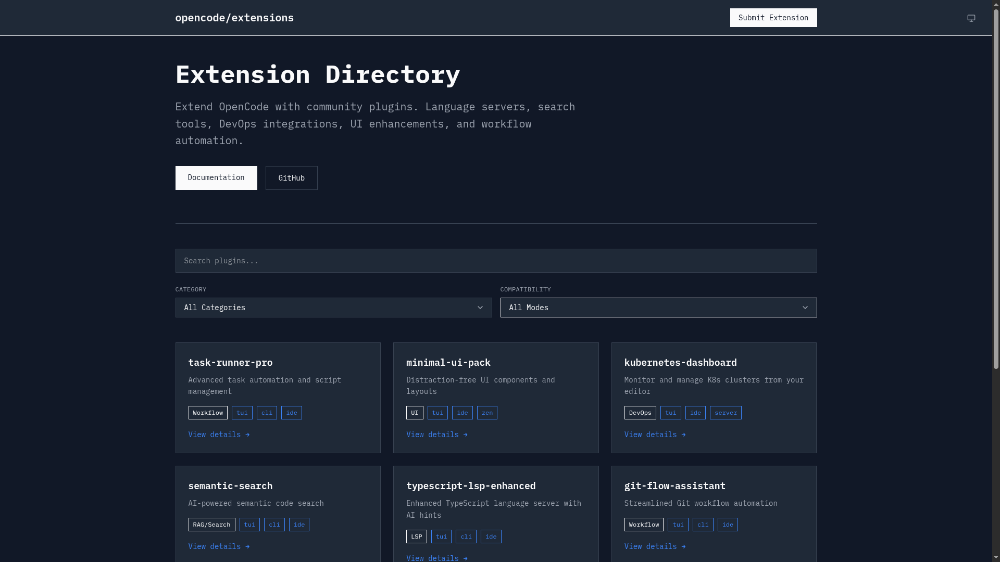

# Opencode Community Extensions

Discover and explore community-built extensions for the Opencode ecosystem. Browse a curated collection of plugins, tools, and integrations that enhance your development workflow.

## What You'll Find

### Extension Categories

- **LSP** - Language Server Protocol extensions for enhanced code intelligence
- **RAG/Search** - Retrieval-augmented generation and search tools
- **DevOps** - Deployment, CI/CD, and infrastructure extensions
- **UI** - User interface enhancements and themes
- **Workflow** - Productivity tools and workflow automations

### Extension Features

Each extension includes:

- **Detailed Description** - What the extension does and how it helps
- **Compatibility** - Supported platforms (TUI, CLI, IDE, Server, Zen)
- **Source Code** - Links to repositories and documentation
- **Version Information** - Latest releases and changelogs
- **Author Information** - Creator details and GitHub profiles

## How It Works

### Browse Extensions

Explore the extension directory with powerful filtering and search:

- **Search** - Find extensions by name or description
- **Category Filter** - Focus on specific types of tools
- **Compatibility Filter** - Find extensions for your platform
- **Tag-Based Discovery** - Browse by functionality and features

### Submit Extensions

Community members can submit new extensions:

- **Simple Form** - Add extension details through our submission form
- **Validation** - Ensure quality and completeness of submissions
- **Community Review** - All submissions reviewed before publication

### Extension Details

Each extension page provides:

- **Overview** - Clear description of functionality and benefits
- **Technical Details** - Compatibility, requirements, and installation
- **Related Extensions** - Discover similar tools in the same category
- **Direct Links** - Quick access to source code and documentation

## Technology

This directory is built with modern web technologies:

- **React 19.2** - Fast, responsive user interface
- **TypeScript 5.9+** - Type-safe and reliable code
- **Tailwind CSS 4.1** - Modern, clean design system
- **Convex** - Real-time data synchronization

## For Developers

Interested in contributing extensions or improving the directory?

- **Submit Extensions** - Share your tools with the community
- **Open Source** - View the codebase on GitHub
- **Modern Stack** - Built with cutting-edge web technologies
- **Community Driven** - Extensions are curated and community-reviewed

## Get Started

Browse the [extension directory](https://your-domain.com) to discover tools that enhance your Opencode development experience.

---

_Part of the Opencode ecosystem - building better development tools together._
